# 全自动 AI 开发流程深度对比分析报告

> **Superpowers · Kiro · OpenSpec** 核心原理 · 工作流程 · 区别与共同点 · 企业流程设计指南
>
> 版本：1.0  | 日期：2026年3月

------

## 目录

1. [背景与目的](https://claude.ai/chat/c41c9dd0-018a-4ea9-b925-b14947d734c1#1-背景与目的)
2. [三大框架核心原理](https://claude.ai/chat/c41c9dd0-018a-4ea9-b925-b14947d734c1#2-三大框架核心原理)
   - 2.1 [Superpowers — 强制纪律框架](https://claude.ai/chat/c41c9dd0-018a-4ea9-b925-b14947d734c1#21-superpowers--强制纪律框架)
   - 2.2 [Kiro — 规格驱动 IDE](https://claude.ai/chat/c41c9dd0-018a-4ea9-b925-b14947d734c1#22-kiro--规格驱动-ide)
   - 2.3 [OpenSpec — 轻量化 SDD 框架](https://claude.ai/chat/c41c9dd0-018a-4ea9-b925-b14947d734c1#23-openspec--轻量化-sdd-框架)
3. [核心差异与共同点](https://claude.ai/chat/c41c9dd0-018a-4ea9-b925-b14947d734c1#3-核心差异与共同点)
4. [适用场景分析](https://claude.ai/chat/c41c9dd0-018a-4ea9-b925-b14947d734c1#4-适用场景分析)
5. [各框架优劣势深度分析](https://claude.ai/chat/c41c9dd0-018a-4ea9-b925-b14947d734c1#5-各框架优劣势深度分析)
6. [企业 AI 开发流程设计指南](https://claude.ai/chat/c41c9dd0-018a-4ea9-b925-b14947d734c1#6-企业-ai-开发流程设计指南)
7. [风险与注意事项](https://claude.ai/chat/c41c9dd0-018a-4ea9-b925-b14947d734c1#7-风险与注意事项)
8. [总结与决策框架](https://claude.ai/chat/c41c9dd0-018a-4ea9-b925-b14947d734c1#8-总结与决策框架)

------

## 1. 背景与目的

随着大语言模型（LLM）能力的指数级增长，软件工程领域正经历深刻变革。开发者已从传统的逐字符编码，进化到「**意图驱动的编排**」（Intent-Driven Orchestration）时代。然而，这一演进并非一帆风顺。

### 当前 AI 辅助编程的主要痛点

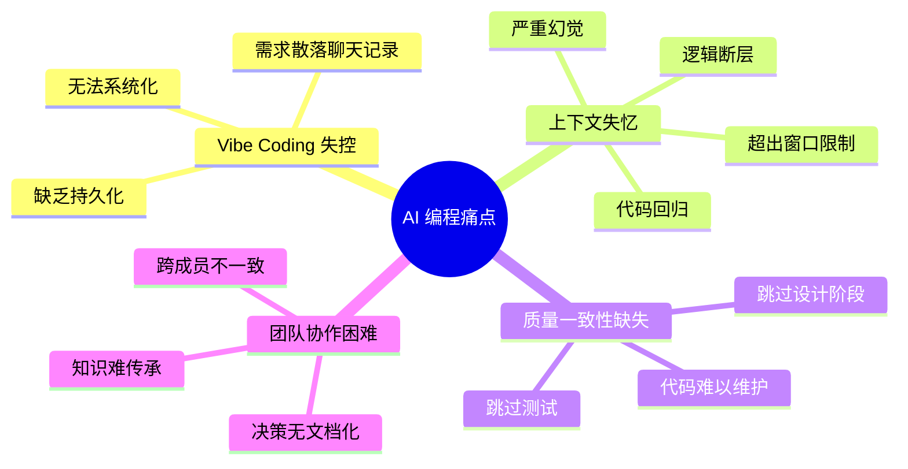

当前 AI 辅助编程的主要痛点集中在以下几个方面：

- **「Vibe Coding」的不可控性**：开发者与 AI 通过非结构化自然语言对话交互，需求散落在冗长聊天记录中，缺乏持久化和系统化。
- **上下文窗口的「失忆」症状**：当对话超出上下文限制，AI 常出现逻辑断层、代码回归甚至严重幻觉（Hallucination）。
- **质量一致性缺失**：AI 倾向于直接跳到编码，跳过设计、测试和审查，生产出难以维护的代码。
- **团队协作困难**：AI 生成的决策缺乏文档化，难以在团队成员之间共享和传承。

为解决上述问题，业界涌现出三种不同哲学取向的全自动 AI 开发流程框架：**Superpowers**、**Kiro** 和 **OpenSpec**。本报告旨在对三者进行深度对比分析，为贵公司设计适合自身特点的 AI 开发流程提供决策依据。

------

## 2. 三大框架核心原理

### 三框架全景概览

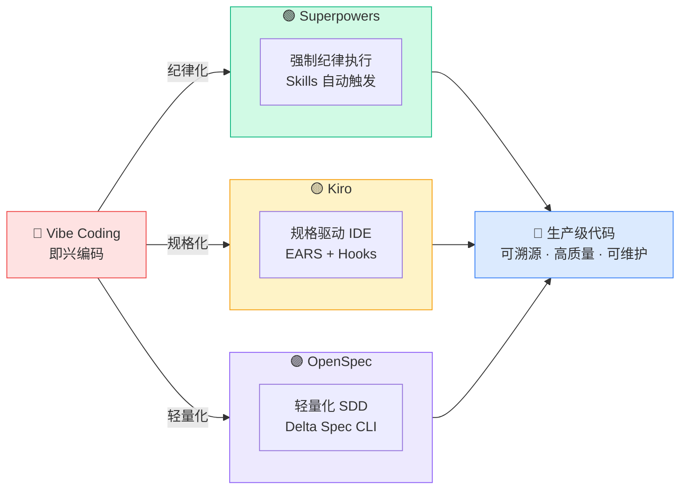

------

### 2.1 Superpowers — 强制纪律框架

> **核心哲学**：「让 AI 更聪明」不如「让 AI 更守纪律」。Superpowers 不追求更强的模型，而是通过强制执行专业软件工程纪律，使现有模型产出生产级代码。

Superpowers 由 Jesse Vincent 于 2025 年 10 月创建，2026 年 3 月已积累 93,000+ GitHub Stars，是增长最快的开源项目之一。

#### 核心思想图

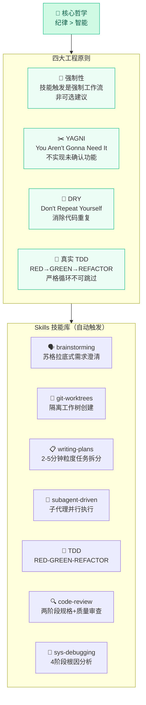

#### 完整工作流程图

```mermaid
flowchart TD
    START(["👤 用户描述需求"]) --> B1

    subgraph PHASE1["Phase 1 · 脑暴设计 (brainstorming)"]
        B1["🗣️ AI 苏格拉底式提问<br/>澄清真实需求"] --> B2
        B2["📄 分段展示设计方案"] --> B3
        B3{"👤 人工审批\n设计文档?"}
        B3 -->|"❌ 修改"| B1
        B3 -->|"✅ 批准"| B4
        B4["💾 保存 design.md"]
    end

    subgraph PHASE2["Phase 2 · 工作树隔离 (git-worktrees)"]
        B4 --> C1["🌿 创建独立 Git Worktree<br/>新分支隔离开发环境"]
        C1 --> C2["🔧 运行项目初始化<br/>验证测试基线 Clean"]
    end

    subgraph PHASE3["Phase 3 · 计划制定 (writing-plans)"]
        C2 --> D1["📋 将设计分解为原子任务<br/>每任务 2-5 分钟"]
        D1 --> D2["📁 标注精确文件路径<br/>完整代码 + 验证步骤"]
        D2 --> D3{"👤 人工确认\n任务计划?"}
        D3 -->|"❌ 调整"| D1
        D3 -->|"✅ 确认"| D4
        D4["📝 锁定 tasks.md"]
    end

    subgraph PHASE4["Phase 4 · 子代理执行 (subagent-driven-development)"]
        D4 --> E1["🤖 为每个任务\n派发独立子代理"]
        E1 --> E2

        subgraph TDD["TDD 循环 (test-driven-development)"]
            E2["🔴 RED\n写失败测试"] --> E3
            E3["✅ 确认测试失败"] --> E4
            E4["🟢 GREEN\n写最少实现代码"] --> E5
            E5["✅ 确认测试通过"] --> E6
            E6["♻️ REFACTOR\n重构提升质量"] --> E7
            E7["✅ 确认仍然通过"]
        end

        E7 --> E8

        subgraph REVIEW["两阶段审查"]
            E8["🔍 Stage 1\n规格合规性审查"] --> E9
            E9{"通过?"}
            E9 -->|"❌"| E10["🚫 阻塞，修复后重审"]
            E10 --> E8
            E9 -->|"✅"| E11["🔍 Stage 2\n代码质量审查"]
            E11 --> E12{"通过?"}
            E12 -->|"❌"| E13["🚫 阻塞，修复后重审"]
            E13 --> E11
            E12 -->|"✅"| E14["✅ 任务完成"]
        end
    end

    subgraph PHASE5["Phase 5 · 完成收尾 (finishing-branch)"]
        E14 --> F1{"还有\n剩余任务?"}
        F1 -->|"✅ 有"| E1
        F1 -->|"🎉 无"| F2["✅ 所有测试通过"]
        F2 --> F3["👤 选择：合并PR / 保留 / 丢弃"]
        F3 --> F4["🧹 清理 Git Worktree"]
    end

    F4 --> END(["🚀 Feature 交付完成"])

    style START fill:#dbeafe,stroke:#3b82f6
    style END fill:#d1fae5,stroke:#10b981
    style PHASE1 fill:#f0fdf4,stroke:#10b981
    style PHASE2 fill:#f0fdf4,stroke:#10b981
    style PHASE3 fill:#f0fdf4,stroke:#10b981
    style PHASE4 fill:#f0fdf4,stroke:#10b981
    style PHASE5 fill:#f0fdf4,stroke:#10b981
    style TDD fill:#ecfdf5,stroke:#34d399
    style REVIEW fill:#ecfdf5,stroke:#34d399
```

------

### 2.2 Kiro — 规格驱动 IDE

> **核心哲学**：将「Vibe Coding（即兴编码）」进化为「Spec-Driven Development（规格驱动开发）」。在写任何代码之前，先与 AI 对齐明确的规格文档，让 AI 充当有纪律的实施者而非灵感驱动的创作者。

Kiro 是 Amazon Web Services 于 2025 年 7 月推出的 AI 原生 IDE（基于 VS Code Fork），定位为企业级规格驱动开发工具。

#### 核心思想图

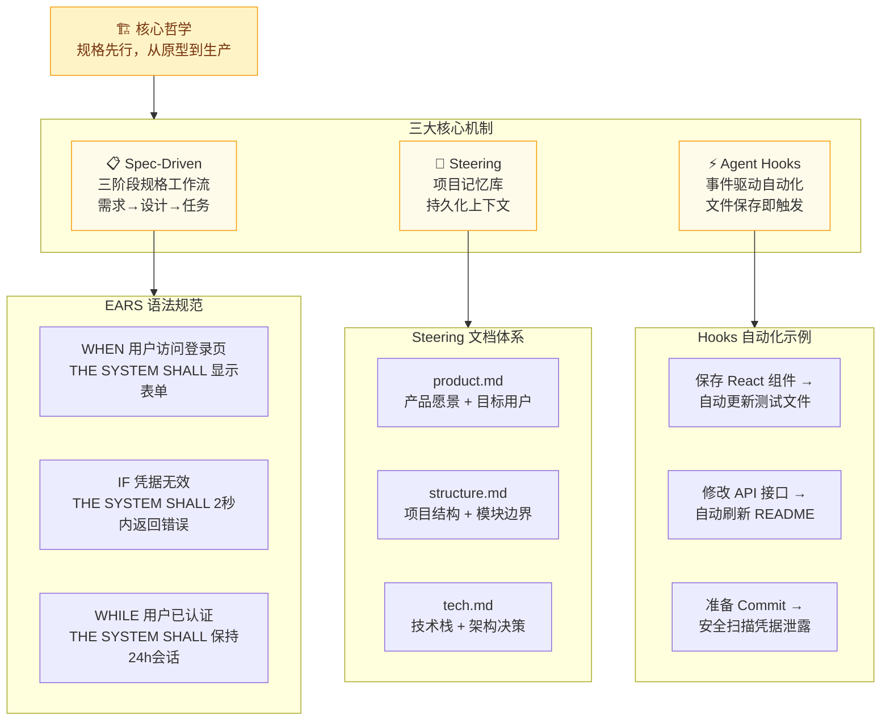

#### 完整工作流程图

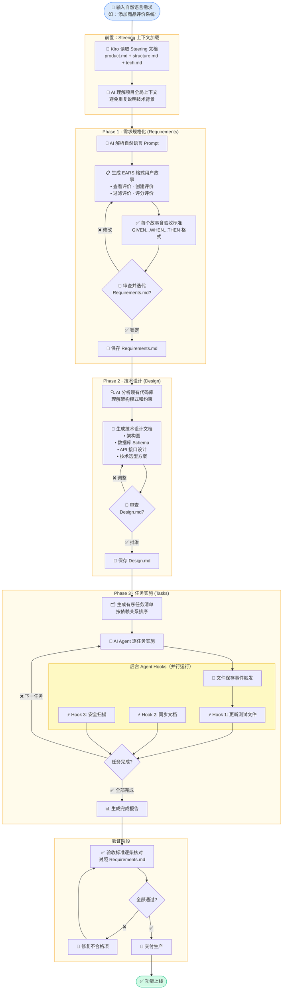

------

### 2.3 OpenSpec — 轻量化 SDD 框架

> **核心哲学**：「规格驱动」不应该成为繁重的负担。OpenSpec 在保持规格先行原则的同时，最小化流程摩擦，支持流动式迭代，特别针对存量代码库（Brownfield）的持续演进设计。

OpenSpec 是 Fission-AI 推出的开源 CLI 工具，通过 Slash 命令与 20+ 主流 AI 编程工具集成，无需切换 IDE 或绑定特定平台。

#### 核心思想图

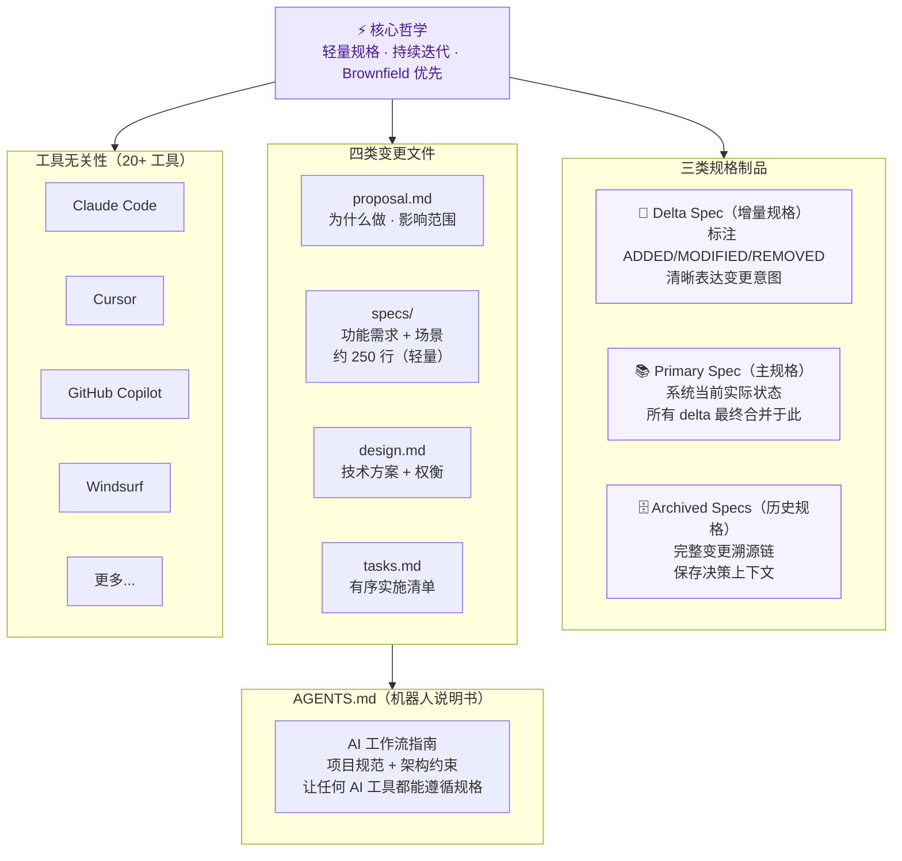

#### 完整工作流程图

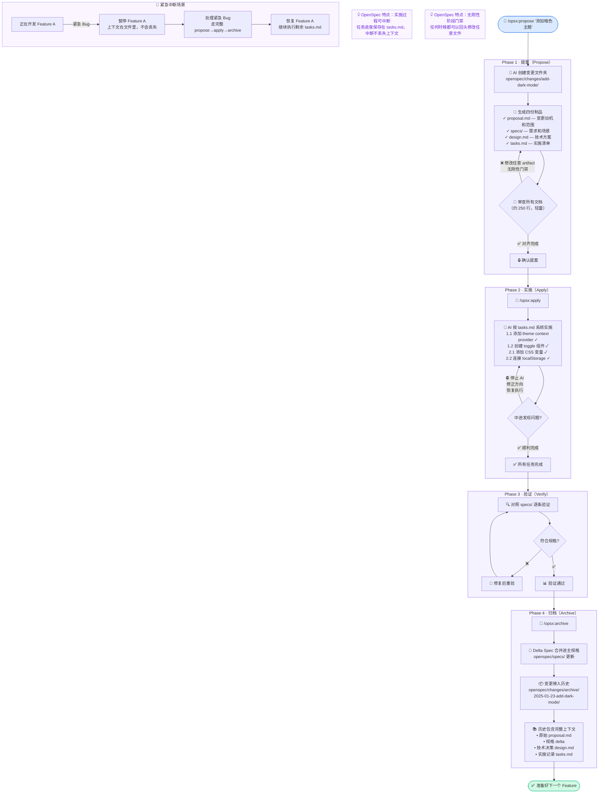

------

## 3. 核心差异与共同点

### 3.1 全维度对比矩阵

| 对比维度           | 🟢 Superpowers                    | 🟡 Kiro                                | 🟣 OpenSpec                          |
| ------------------ | -------------------------------- | ------------------------------------- | ----------------------------------- |
| **定位**           | AI编码纪律执行框架               | AI原生 Spec-Driven IDE                | 轻量级 SDD CLI 工具                 |
| **发布时间**       | 2025年10月（开源）               | 2025年7月（AWS）                      | 2025年（开源）                      |
| **核心理念**       | 强制纪律 > 智能提升              | 规格先行，计划后编码                  | 轻量化规格，持续迭代                |
| **工作流程**       | 5阶段（脑暴→计划→TDD→执行→审查） | 3阶段（需求→设计→任务）               | 4阶段（提案→规格→实施→归档）        |
| **规格文件**       | Markdown（SKILL.md）             | EARS 语法需求 + 设计文档              | proposal/specs/design/tasks.md      |
| **记忆机制**       | Skills 自动触发文件              | Steering（product/structure/tech.md） | AGENTS.md + 持久化 specs/           |
| **IDE 绑定**       | Claude Code / Cursor / Codex     | 专属 VS Code Fork（仅限Kiro）         | 20+ 工具（Cursor/Claude/Copilot等） |
| **LLM 支持**       | 灵活选择（推荐Opus）             | 默认Claude Sonnet，Auto模式           | 高推理模型（Opus/GPT）              |
| **TDD 支持**       | ✅ 强制 RED-GREEN-REFACTOR        | ⚠️ 可选任务测试                        | ⚠️ 不强制，由实施决定                |
| **事件自动化**     | Git Worktree / 子代理调度        | Agent Hooks（文件保存触发）           | 命令驱动，无自动钩子                |
| **Brownfield支持** | ⚠️ 有限                           | ⚠️ 中等（Steering辅助）                | ✅ 原生支持，Delta Spec设计          |
| **变更溯源**       | ⚠️ Git日志 + 计划文件             | ⚠️ Tasks.md归档                        | ✅ 完整归档含提案/设计/任务          |
| **团队协作**       | 共享Skills库                     | Steering文件共享                      | AGENTS.md + 规格文件共享            |
| **学习曲线**       | 中等                             | 中等（需适应新IDE）                   | 低（5分钟上手）                     |
| **适合场景**       | 复杂功能/生产代码质量要求高      | 企业级AWS生态/新项目                  | 存量代码库/迭代式改进               |
| **开源性**         | ✅ 完全开源（GitHub）             | ❌ 闭源（AWS产品）                     | ✅ 完全开源（GitHub）                |
| **价格**           | 免费                             | 预览期免费，后续付费                  | 免费（无API Key）                   |

------

### 3.2 工作流阶段对比

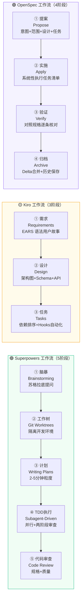

------

### 3.3 四大共同点

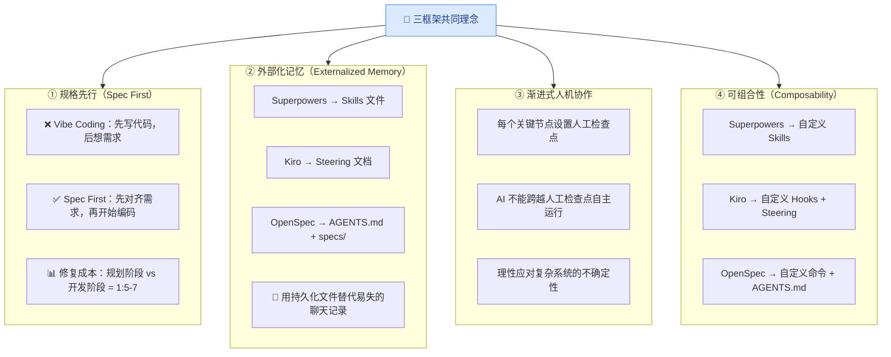

------

### 3.4 三大核心区别

```mermaid
radar
    title 三框架能力雷达图
    options
      max: 10
    "强制执行力": [10, 6, 3]
    "TDD支持": [10, 4, 3]
    "Brownfield": [3, 5, 10]
    "工具灵活性": [5, 2, 10]
    "IDE体验": [6, 10, 4]
    "上手容易度": [5, 5, 10]
    "变更溯源": [4, 6, 10]
    "企业集成": [5, 10, 6]
```

**① 执行强制性**

| 框架        | 强制程度   | 说明                                    |
| ----------- | ---------- | --------------------------------------- |
| Superpowers | ⭐⭐⭐⭐⭐ 最强 | 技能触发是强制工作流，AI 不遵循会被阻止 |
| Kiro        | ⭐⭐⭐ 中等   | IDE 内置引导，但部分步骤可跳过          |
| OpenSpec    | ⭐⭐ 最灵活  | 无刚性阶段门禁，随时可更新任意 artifact |

**② 工具绑定程度**

| 框架        | 绑定程度 | 说明                             |
| ----------- | -------- | -------------------------------- |
| Kiro        | 🔒 最高   | 仅限自家 IDE，仅支持 Claude 模型 |
| Superpowers | 🔓 中等   | 支持多工具，依赖 Plugin 系统     |
| OpenSpec    | 🌐 最低   | 工具无关，支持 20+ AI 编程工具   |

**③ 规格文件精细程度**

| 框架        | 精细程度 | 特点                                    |
| ----------- | -------- | --------------------------------------- |
| Superpowers | 最详细   | 每任务含完整代码和验证步骤，2-5分钟粒度 |
| Kiro        | 中等详细 | EARS 语法需求 + 架构设计 + 任务序列     |
| OpenSpec    | 最轻量   | 约 250 行 specs，比同类工具轻 3 倍      |

**④ 目标项目类型**

| 框架        | 最适合                         | 次适合                 |
| ----------- | ------------------------------ | ---------------------- |
| Superpowers | 复杂新功能，生产环境质量要求高 | 多文件联动功能         |
| Kiro        | 企业级新项目，AWS 生态         | 需要正式规格管理的团队 |
| OpenSpec    | 存量代码库增量改进             | 快速小改动，多工具团队 |

------

## 4. 适用场景分析

| 使用场景                     | 🟢 Superpowers | 🟡 Kiro | 🟣 OpenSpec | 推荐理由                                 |
| ---------------------------- | ------------- | ------ | ---------- | ---------------------------------------- |
| 全新项目（Greenfield）开发   | ✅             | ✅      | ⚠️          | Kiro IDE体验流畅；Superpowers脑暴优秀    |
| 存量代码库（Brownfield）改造 | ⚠️             | ⚠️      | ✅          | OpenSpec Delta Spec 专为增量改造设计     |
| 复杂多文件功能开发（2h+）    | ✅             | ✅      | ⚠️          | Superpowers 子代理并行+TDD；Kiro有序任务 |
| 快速 Bug 修复 / 小改动       | ⚠️             | ⚠️      | ✅          | OpenSpec 轻量提案，5分钟内启动           |
| AWS 云原生企业应用           | ⚠️             | ✅      | ⚠️          | Kiro 深度集成 AWS Bedrock / CDK          |
| 高代码质量 / TDD 要求        | ✅             | ⚠️      | ⚠️          | Superpowers 强制 RED-GREEN-REFACTOR      |
| 多人协作团队                 | ✅             | ✅      | ✅          | 三者均有共享规格机制，Kiro Hooks统一标准 |
| 多工具混合环境               | ⚠️             | ⚠️      | ✅          | OpenSpec 支持 20+ AI 工具，无 IDE 锁定   |
| 变更可溯源 / 合规审计        | ⚠️             | ✅      | ✅          | OpenSpec 完整归档；Kiro Tasks 可追踪     |

> ✅ = 强项  | ⚠️ = 有限支持或需额外配置

> 💡 **关键洞察**：没有一个框架适合所有场景。一个成熟的企业 AI 开发流程往往需要融合多个框架的优点，而非选择其一。

------

## 5. 各框架优劣势深度分析

### 5.1 Superpowers

#### ✅ 核心优势

- **最强的代码质量保障**：强制 TDD + 两阶段代码审查，能有效捕获 AI 自身的错误
- **子代理并行化**：多个子代理同时执行不同任务，效率远超单线程执行
- **完整的工程文化植入**：将 YAGNI、DRY、TDD 等工程原则编码进工作流，不依赖个人自律
- **高度可扩展**：Skills 是 Markdown 文件，团队可以自定义和贡献，支持无限扩展
- **强大的调试框架**：4 阶段系统性调试，远超普通「重试 prompt」的低效方法

#### ⚠️ 主要局限

- **认知负担较高**：结构化流程意味着更多前置思考，不适合快速原型验证
- **对小改动过度工程化**：修复一个简单 Bug 也要走完整 Brainstorm→Plan→TDD 流程
- **Brownfield 支持有限**：Skills 系统主要针对新功能开发，对历史代码库理解有限
- **缺乏 IDE 原生集成**：以 Claude Code Plugin 为主，没有 Kiro 那样完整的 IDE 体验

------

### 5.2 Kiro

#### ✅ 核心优势

- **最完整的 IDE 集成体验**：从需求到代码在同一 IDE 内完成，无上下文切换
- **EARS 语法规范化**：消除需求歧义，使用户故事更精确，便于 AI 实施
- **Agent Hooks 自动化**：基于事件的后台代理，统一团队代码标准、自动更新测试和文档
- **企业级规格体系**：Requirements + Design + Tasks 三文档分离，适合需要正式规格的企业
- **AWS 生态深度整合**：对使用 AWS 云服务的团队有显著优势

#### ⚠️ 主要局限

- **IDE 锁定风险**：强制使用 Kiro 自家 IDE，无法在 Cursor、VS Code 等现有工具中使用
- **LLM 选择有限**：主要支持 Claude 模型，限制了模型灵活性
- **小任务过度设计**：一个简单 Bug 可能生成 4 个用户故事 + 16 条验收标准
- **学习曲线**：EARS 语法、Hooks 配置、Steering 管理需要团队适应期
- **闭源产品依赖**：作为 AWS 商业产品，长期成本和路线图不在团队掌控之中

------

### 5.3 OpenSpec

#### ✅ 核心优势

- **最低上手门槛**：5 分钟内可以在现有项目中启用，无需切换工具
- **Brownfield 原生支持**：Delta Spec 专为存量代码库设计，最适合渐进式改造
- **完整变更历史**：每次变更的完整上下文（为什么做、怎么做、做了什么）都被永久保存
- **工具无关性**：与 20+ AI 工具集成，保护现有工具投资
- **最轻的认知负担**：规格约 250 行，无刚性阶段门禁，在迭代中灵活调整
- **隐私友好**：无需 API Key，规格文件存储在本地代码库中

#### ⚠️ 主要局限

- **无强制执行机制**：流程完全依赖团队自律，AI 有时可能跳过规格直接编码
- **无原生 TDD 支持**：不内置测试驱动开发流程，需要团队自行约定
- **无自动化钩子**：没有 Kiro 那样的事件驱动自动化，需要手动触发每个阶段
- **大型复杂功能挑战**：对于需要 20+ 小时开发的大型功能，轻量结构可能不够
- **规格漂移风险**：规格文件和代码之间的同步依赖人工维护

------

## 6. 企业 AI 开发流程设计指南

### 6.1 五大设计原则

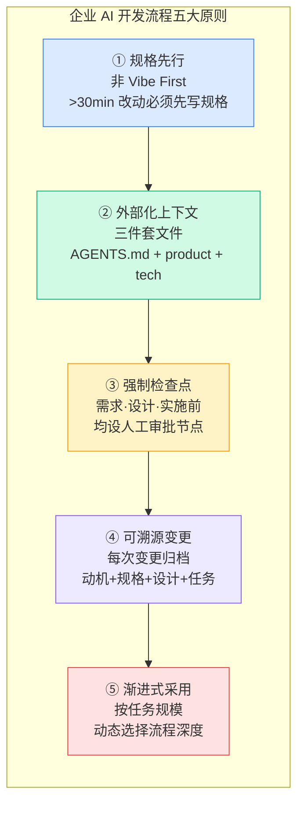

------

### 6.2 综合流程设计框架（三档模式）

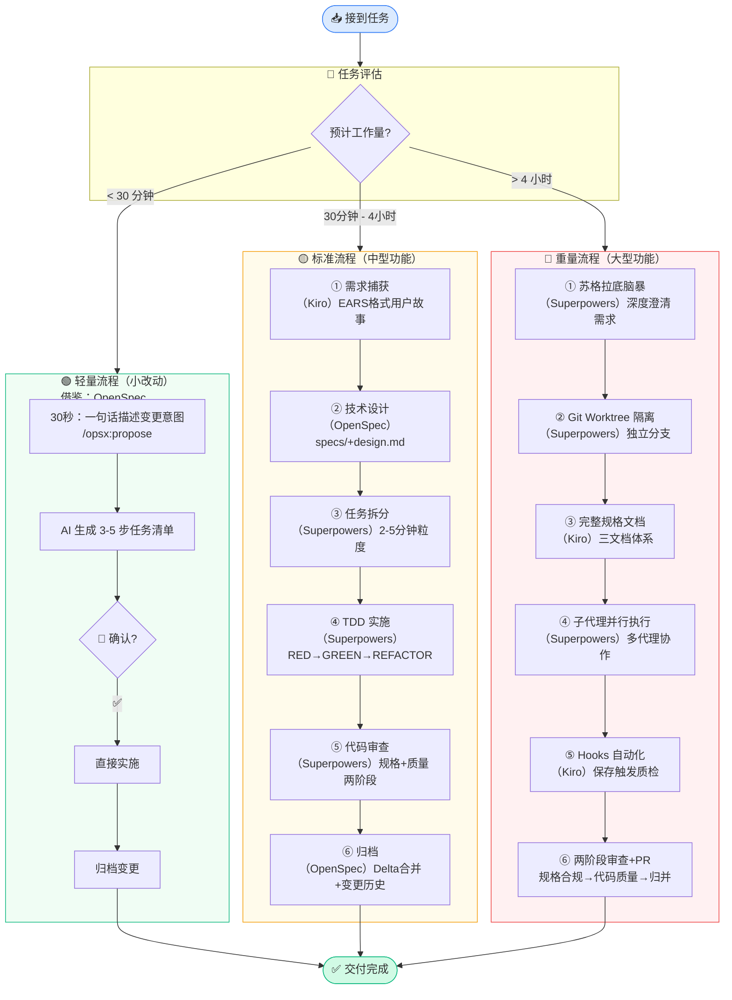

------

### 6.3 企业流程节点设计参考

| 流程节点       | 借鉴来源                                  | 实施建议                                              |
| -------------- | ----------------------------------------- | ----------------------------------------------------- |
| **需求捕获**   | Kiro EARS 语法 + Superpowers 苏格拉底脑暴 | 强制输出 User Story + 验收标准，AI辅助生成，人工审核  |
| **技术规格**   | OpenSpec specs/ + Kiro Design.md          | 建立统一的 spec 文件夹，包含 proposal/design/API 契约 |
| **任务拆分**   | Superpowers Writing Plans + Kiro Tasks    | 每任务限定2-5分钟粒度，标注文件路径和验收标准         |
| **代码实施**   | Superpowers 子代理 + OpenSpec /apply      | 优先 TDD，子代理并行执行，定期人工检查点              |
| **质量审查**   | Superpowers 两阶段审查（规格+质量）       | 规格合规性先行，再做代码质量审查，阻塞制              |
| **文档归档**   | OpenSpec Archive + Kiro Steering          | 自动将 specs 合并入主文档，保留完整变更历史           |
| **自动化钩子** | Kiro Agent Hooks                          | 配置文件保存触发测试更新、文档同步、安全扫描          |
| **上下文管理** | Kiro Steering + OpenSpec AGENTS.md        | 每个项目维护 product.md / tech.md / AGENTS.md 三件套  |

------

### 6.4 项目上下文体系建议

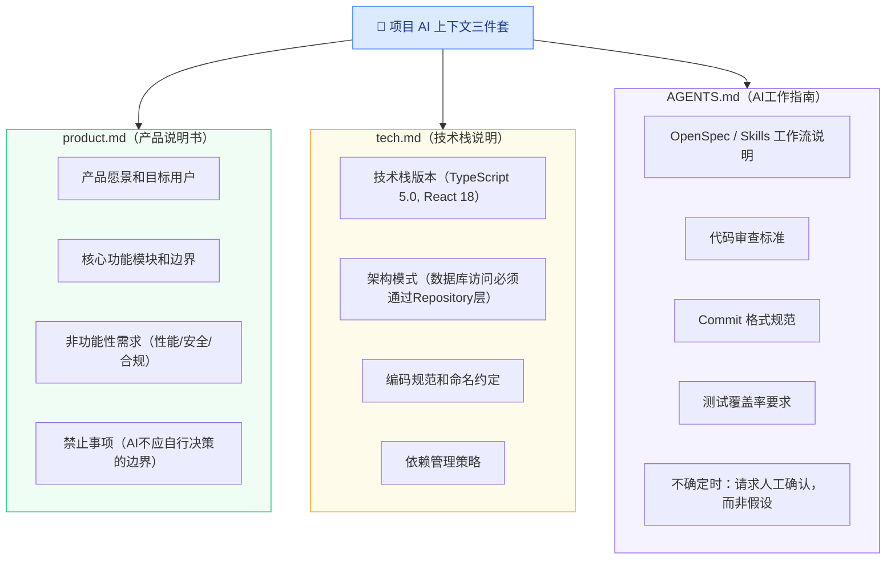

------

### 6.5 工具选型建议（按团队规模）

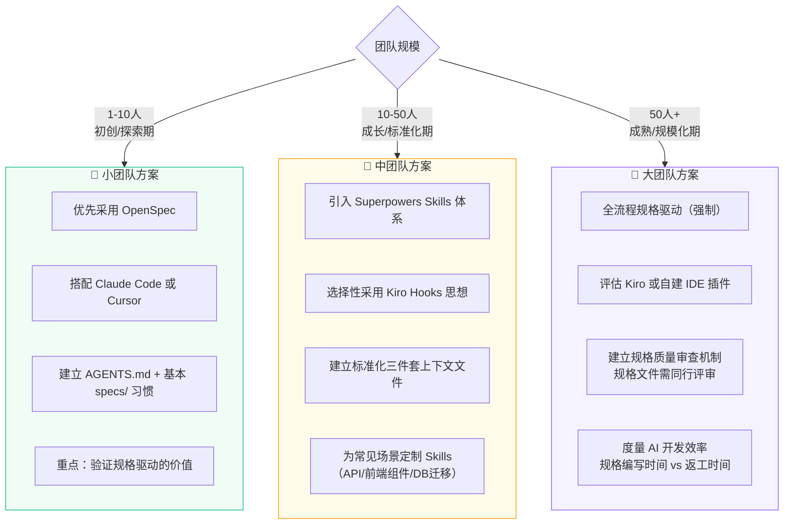

------

## 7. 风险与注意事项

### 7.1 通用风险

- **「Trivial 任务」的过度工程化**：三个框架都不适合 5 分钟内可完成的修改，强行套用反而降低效率
- **规格漂移（Spec Drift）**：规格文件在快速迭代中可能落后于实际代码，需要定期同步机制
- **认知过载**：管理规格文件、检查点、变更历史本身会产生额外认知负担，需要团队适应期
- **过度依赖 AI 审查**：两阶段审查不能替代人工代码审查，特别是安全性和业务逻辑方面

### 7.2 特定风险

| 框架        | 风险类型       | 风险描述                                     |
| ----------- | -------------- | -------------------------------------------- |
| Superpowers | 学习曲线风险   | Skills 体系需要团队统一学习，可能遇到抵制    |
| Kiro        | 供应商锁定风险 | 作为 AWS 闭源产品，路线图不透明，退出成本高  |
| OpenSpec    | 自律依赖风险   | 轻量流程依赖团队自律，没有强制机制时可能退化 |

### 7.3 落地实施建议

1. **从小规模试点开始**：选择 2-3 个代表性项目试点，而非全公司铺开
2. **设定明确成功指标**：如「代码审查返工率下降 X%」「Bug 逃逸率降低 Y%」
3. **保留 Vibe Coding 通道**：对探索性 POC 项目，不强制规格流程
4. **定期回顾规格价值**：每 Sprint 评估规格文档是否真正减少了返工
5. **逐步自定义框架**：不要直接使用三者的默认配置，根据团队需求裁剪和扩展

------

## 8. 总结与决策框架

### 8.1 一句话总结

- 🟢 **Superpowers**：执行力最强的「AI 纪律官」，适合对代码质量要求极高的生产环境
- 🟡 **Kiro**：体验最完整的「企业规格 IDE」，适合 AWS 生态下的企业新项目
- 🟣 **OpenSpec**：接入成本最低的「轻量化规格层」，适合存量代码库的渐进改造

> 最佳实践是将三者的设计思想**融合**，而非非此即彼。

------

### 8.2 决策流程图

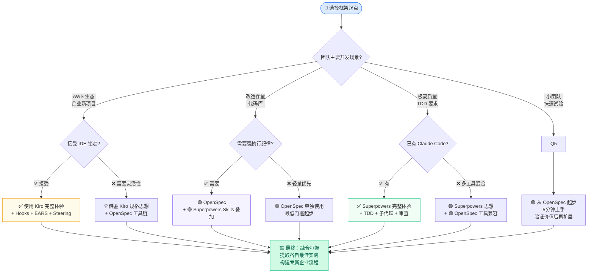

------

### 8.3 融合框架五层架构

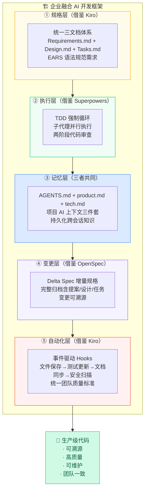

------

> **— 报告结束 —**
>
> 本文档基于 Superpowers（GitHub obra/superpowers）、Kiro（kiro.dev，AWS）、OpenSpec（GitHub Fission-AI/OpenSpec）的公开文档、社区分析及实践案例综合整理，截止日期 2026 年 3 月。